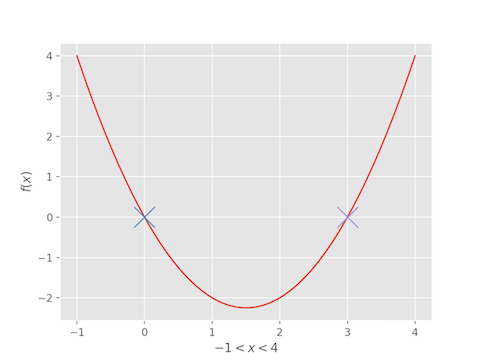

# Description
This is a collection of various numerical methods implemented in Python. Every method is implemented
using Numpy arrays. The intention of this package is for anyone who wants to have simple and concices
implementation of various different numerical methods.

# Root finding methods
- Bisection
- Newton's method
- Secant method
- Cuadratic linear interpolation
- Fractional linear interpolation

# Systems of Equations
- Newton's method
- Broyden's method
- Newton's method with cushioning

# Optimization in One Variable
- Golden section search
- Successive parabolic interpolation
- Newton's method

# Optimization in Multiple Variables
- Nelder-Mead
- Gradient Descent
- Newton's method
- BFGS
- BFGS with line search
- Gradient conjugate

# Least Squares
- Gauss-Newton

# Fourier Transform
- FFT
- Inverse FFT

